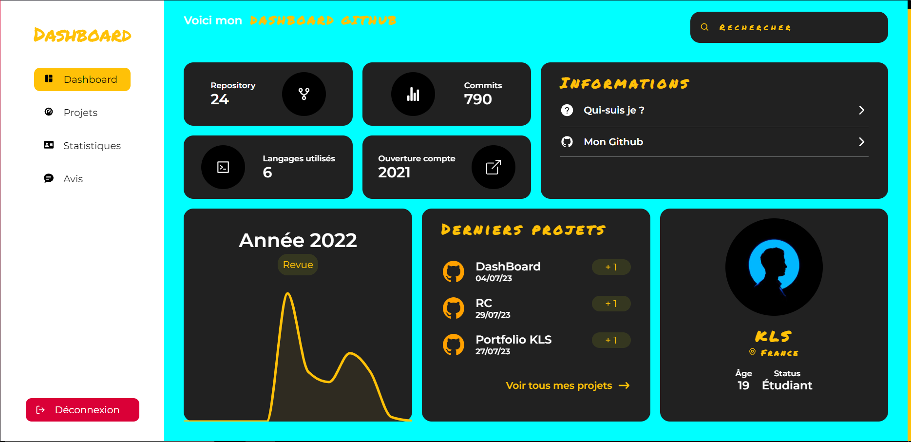

# Dashboard GitHub | En cours de réalisation

Ce projet est un dashboard permettant de visualiser différentes données provenant de mon GitHub personnel.

Il fournit un aperçu de mes contributions mensuelles sur l'année
précédente, ainsi que des statistiques sur les langages de programmation, les technologies et les sujets que j'ai utilisés dans mes dépôts.

## Prévisualisation



## Fonctionnalités

- Page d'accueil regroupant les informations principales avec système de filtres pour la recherche
- Page profil regroupant quelques informations sur mon profil
- Page projets présentant les différents dépôts que j'ai créés avec une courte description
- Page langage présentant les différents langages de programmation que je maîtrise

## Technologies utilisées

- [React](https://reactjs.org/)
- [JavaScript](https://developer.mozilla.org/fr/docs/Web/JavaScript)
- [HTML](https://developer.mozilla.org/fr/docs/Web/HTML)
- [CSS](https://developer.mozilla.org/fr/docs/Web/CSS)

## Installation

Avant de démarrer cette application, il est nécessaire de suivre les étapes suivantes :

1. Avoir installé [Node.js](https://nodejs.org/en/), [npm](https://www.npmjs.com/) et [yarn](https://yarnpkg.com/) sur sa machine
2. Cloner ce dépôt de code à l'aide de la commande disponible sur GitHub
```bash
git clone
```
3. Installer la commande [create-react-app](https://www.npmjs.com/package/create-react-app) à l'aide de la commande suivante
```bash
npm install -g create-react-app
```
4. Créer un dossier à l'aide de la commande suivante
```bash
create-react-app nom_du_dossier
```
5. Se rendre dans le dossier créé et supprimer les dossiers suivants
```bash
cd nom_du_dossier
rm -rf src
```
6. Copier le dossier src du dépôt de code dans le dossier créé
7. Installer les dépendances du projet à l'aide de la commande suivante
```bash
npm install
```
8. Installer les modules suivants à l'aide de la commande suivante
```bash
npm install styled-components scrollreveal react-icons recharts
```
9. Lancer l'application à l'aide de la commande suivante
```bash
yarn start
```

## Auteur

- **KLS**
